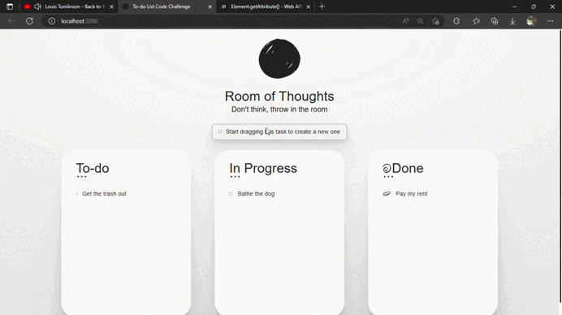

# To-do list code challenge

## update 
refactored version and solved the bugs of arrays manipulation and objects

Double Click on a task to open more informations.  
click on the indicator to the left of the task to change its status (to do, in progress and done) or move the task between columns

## Make it run

### `npm start`

Runs the app in the development mode.\
Open [http://localhost:3000](http://localhost:3000) to view it in your browser.
